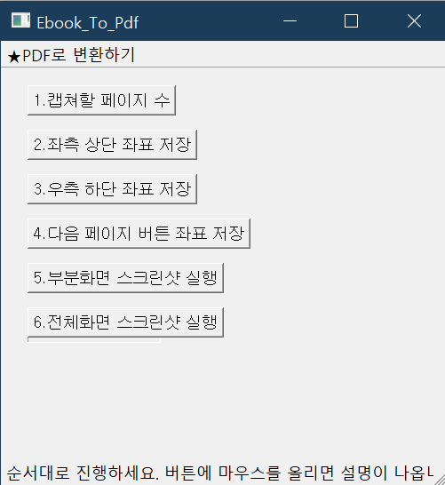
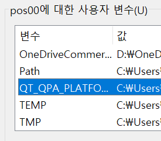

# Ebook-capture-macro-py 제작기

  

### 레퍼런스 : https://infinitt.tistory.com/291

[](https://infinitt.tistory.com/291)

→ 스크린샷이 막힌 EBook프로그램에는 먹통이 되는 문제를 윈도우 전체 스크린샷 기능으로 해결. 윈도우 내장 스크린샷 기능을 사용할 경우 EBook 프로그램의 스크린샷 방지 기능을 뚫을 수 있기 때문. 만약에 이것마저 막힌다면 해당 프로그램 또한 먹통이 될 예정.

  

### 사용법 :

1. main.exe 파일을 실행
2. 1-캡쳐할 페이지 수 지정
3. 6-전체화면 스크린샷 실행
4. 윈도우 스크린샷 저장 경로 (내 pc->사진->스크린샷)로 이동
5. 스크린샷 이미지 파일을 클릭 후 창 최대화
6. 2-좌측 상단 좌표 저장
7. 3-우측 상단 좌표 저장
8. 부분화면 스크린샷 실행
9. PDF로 변환하기 클릭 후 pdf로 뭉치고자 하는 이미지 파일 전체 선택 (파일이름 순서대로 pdf로 합쳐짐)

  

  

  

### 프로그램 실행 화면 :

  

  

  

  

  

  

### 에러/오류 해결과정 :

모든 문제는 pyinstaller에서 발생했다..

  

- euc-kr 문제

python과 한국어는 상성이 참 안 좋다.

pyinstaller 또한 한국어 str이 있으면 오류를 뿜뿜한다.

  

에러 메세지

```
unicodeDecodeError : 'utf-8' codec can't decode byte 0xff

```

  

해결 방법은 main.py(소스코드) 맨 위에

```
#-*- coding:utf-8 -*-
or
# -*- coding: euc-kr -*-

```

를 추가해주는 것이다.

다른 사람들을 보면 utf-8로 해결을 했지만, 제작자는 euc-kr로 해결했다.

맥과 윈도우의 차이가 아닐까 예상해본다.   

  

  

  

- import 문제

pyinstaller는 특정 모듈을 가지고 ModuleError 메세지를 띄우면서 exe파일 생성을 해주지 않았다. 심지어 소스코드에도 없는 모듈이었다.

```
# 모듈 블랙리스트
pynput.keyboard._win32
pynput.mouse._win32
PyQt5.QtCore

```

  

해결방법은 오류를 내뿜는 모듈명을 `⁠hidden` 하는 것이다.

pyinstaller cli로 exe파일을 생성할 때 hidden을 지정할 수 있다.

\+ 다른 사람들은 main.spec 파일에서 hiddenimports = \[\] 안에 미리 지정해놓으면 된다고 하던데, pyinstaller cli로 exe파일을 생성할 때마다 해당 리스트가 초기화되는 문제가 발생했다.

```
pyinstaller --hidden-import="pynput.keyboard._win32" --hidden-import="pynput.mouse._win32" --hidden-import="PyQt5.QtCore" --onefile main.py

```

  

  

  

  

  

  

- 용량 뻥튀기 문제

conda와 pyinstaller가 서로 잘 맞지 않아서, conda가 가진 모든 라이브러리를 함께 실행파일에 담아버리는 문제가 있었다. numpy와 pandas를 사용하지 않아도 프로그램 안에 전부 집어 넣은 것이다.

  

해결에 도움을 준 링크

[https://coding-kindergarten.tistory.com/173](https://coding-kindergarten.tistory.com/173)  

[https://coding-kindergarten.tistory.com/172](https://coding-kindergarten.tistory.com/172)  

  

해결 방법은 바로 python 가상환경을 세팅하는 것이었다. 우선 conda를 사용하지 하지 말아야 하기 때문에, python을 설치한 후 interpreter를 python으로 설정한다.

\+ 제작자는 python 2.x 버전이 설치되어 있었는데 이게 화근이 되었었다.

python 3.x 버전부터 가상환경 세팅을 하게 해주는 venv 명령어를 사용할 수 있던 것이다.

python 3.x를 설치했음에도 기존 2.x버전이 남아있어서 애를 먹었었는데, 그냥 ‘프로그램 추가제거’에서 python 2.x를 제거하면 자동으로 3.x CLI를 인식한다.

  

  

  

- Qt Platform plugin error - PyQt5 환경변수 문제

이 문제는 가상환경에서 만든 exe파일을 실행했을 때 문제가 발생했다. 가상환경 이전에 conda로 만든 exe파일에서는 전혀 없던 문제였다. 

```
 qt.qpa.plugin: Could not find the Qt platform plugin "windows" in "" 

```

라는 error 메시지와 함께 프로그램이 자꾸 강종되었다.

PyQt5를 다시 설치해보고, 별에 별 짓을 다해봤지만 전부 실패했었다.

  

해결에 도움을 준 링크

[https://superhky.tistory.com/168](https://superhky.tistory.com/168)  

  

해결방법은 “환경 변수” 설정이다. (환경변수는 정말 지긋지긋하다.)

  

> 해결에 도움을 준 링크에서 발췌:  
>   
> 환경 변수의 이름은 `QT_PLUGIN_PATH` 이고, 변수 값은 `platforms`라는 폴더가 있는 경로를 지정하면 된다. 보통 `~~\Python\site-packages\PyQt5\Qt5\plugins`에 있다.

  

  

  

### 아직 해결하지 못한 에러/오류 :

- pyinstaller에서 프로그램 Icon 설정이 아직 안 된다.
